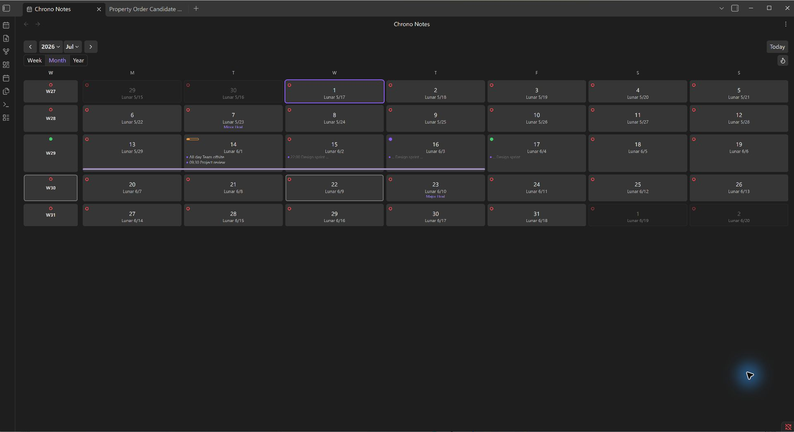
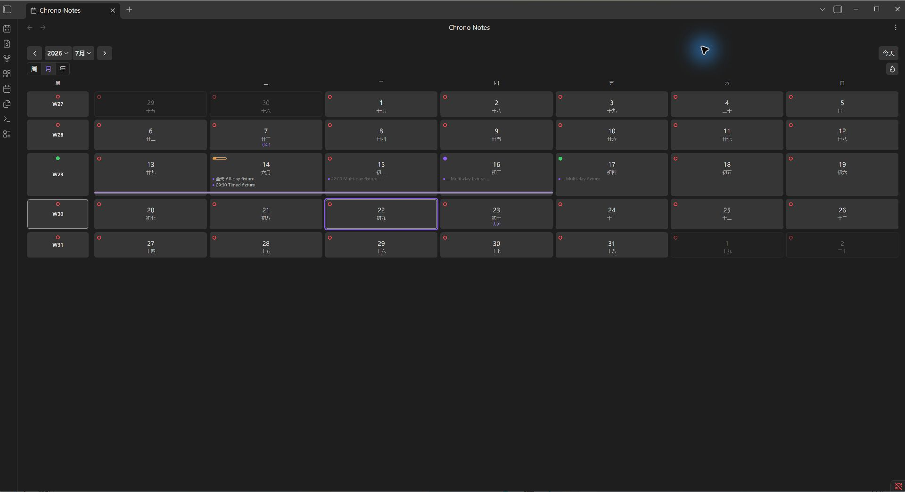
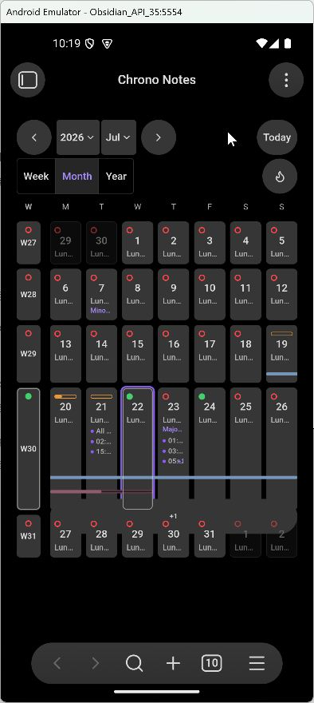

# Chrono Notes

Chrono Notes is an Obsidian calendar workspace for periodic notes, Chinese lunar dates, regional holidays, tasks, statistics, and time-range notes.

> Current release: 0.1.0. Functional parity and repository-side release hardening are implemented. The current artifact passes the automated release gates and has been verified in isolated desktop and Android-emulator Vaults. Physical-device verification remains outstanding. The official Mainland China 2027 holiday schedule is not yet published, so the gate preserves `unavailable`, emits a warning, and never substitutes predicted data.

## Screenshots

English desktop month view:



Simplified Chinese desktop month view:



English Android month view:



## Product scope

- Year, month, and week views.
- Daily, weekly, monthly, quarterly, and yearly notes.
- Chinese lunar calendar overlay with solar terms and traditional festivals.
- Mainland China and Singapore holiday extensions.
- Tasks, note statistics, heatmaps, range notes, templates, previews, and local read-only ICS files.
- English, Simplified Chinese, and Traditional Chinese UI.

Calendar information and plugin settings stay inside the Vault. ICS sources are local, read-only files selected by the user; Chrono Notes does not require an account or send calendar and note data to a remote service.

## Getting started

1. Enable the periodic-note types you use and confirm their path patterns under Chrono Notes settings.
2. Open the main calendar from the ribbon or command palette.
3. Optionally enable Chinese lunar or Ganzhi overlays, Mainland China or Singapore holidays, and local ICS sources.
4. Select a date to open or create its periodic note. Deleting a periodic note uses Obsidian's configured trash behavior.

See [Product requirements](docs/product-requirements.md), [Architecture](docs/architecture.md), and the Chinese [feature parity checklist](docs/feature-parity.zh-CN.md).

## Manual installation

Download `chrono-notes-<version>.zip` from the [latest release](https://github.com/ZHYX91/obsidian-chrono-notes/releases/latest) and extract it directly into `Vault/.obsidian/plugins/`. The archive already contains the `chrono-notes/` plugin directory with `main.js`, `manifest.json`, and `styles.css`; reload Obsidian, then enable Chrono Notes under Community plugins. The same three files remain available as separate release assets for Obsidian's automatic installer and updater.

## Development

```bash
pnpm install
pnpm check
pnpm dev
```

Development requires Node.js 22.13 or later in the 22.x line, or Node.js 24 and later, plus pnpm 11.7.0. CI uses Node.js 24. The minimum Obsidian app version is 1.12.7. Development uses exactly pinned Obsidian API typings 1.12.3; app and typings versions serve different purposes and need not share the patch number.

`pnpm check` runs the source-style gate, strict type checking, the complete Vitest suite, the production build, and artifact contracts. `pnpm release:check` also runs UTC/DST time-zone tests, the deterministic 1,000-note quick benchmark, and current/next-year holiday coverage. A missing current year, published-but-unrecorded following year, or unverified primary source blocks; a following year verified as not yet officially published passes with a warning. Use `pnpm bench:large` for the 10,000-note benchmark. The production plugin bundle is written to `dist/chrono-notes/`. Real minimum/current Obsidian, real mobile, Profiler, and heap checks follow the [manual release gates in the testing strategy](docs/testing-strategy.md#manual-release-gates).

## 中文

简体中文说明见 [README.zh-CN.md](README.zh-CN.md)。
