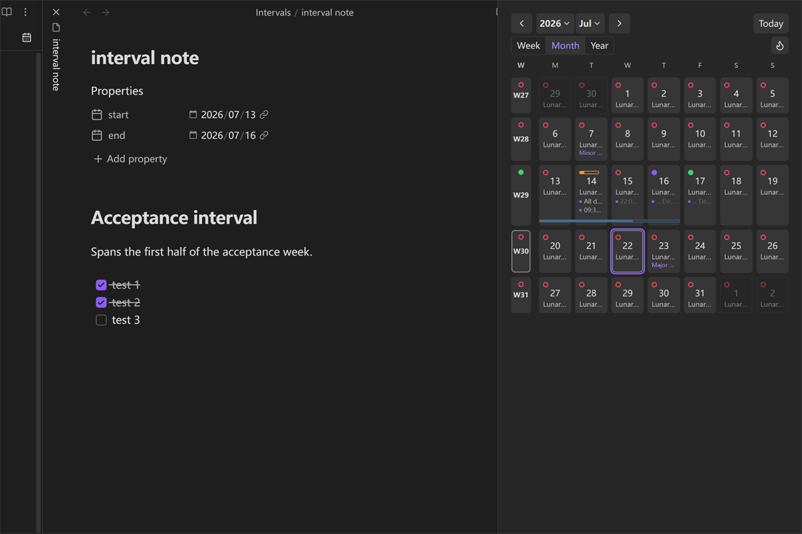
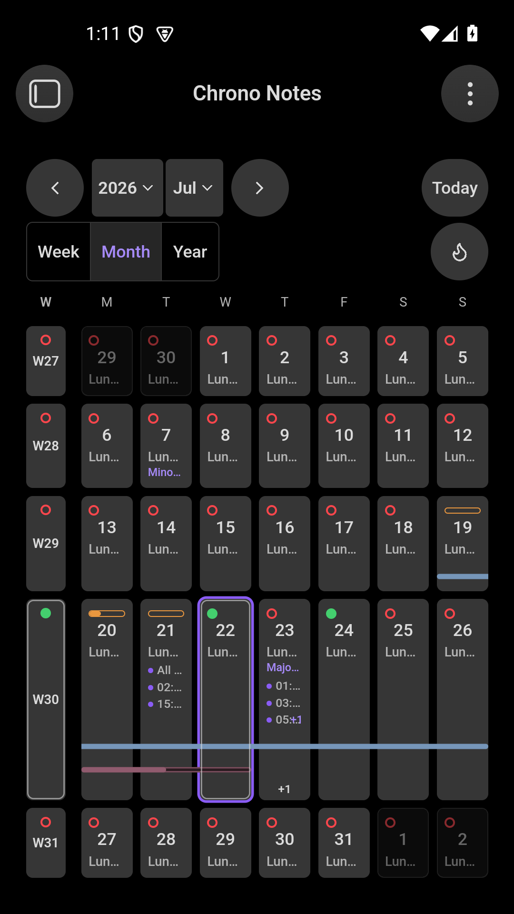

# Chrono Notes（时序笔记）

Chrono Notes 是一个面向 Obsidian 周期笔记工作流的日历插件，整合周期笔记、中国农历、地区节假日、任务、统计和区间笔记。

> 当前版本：0.1.0。功能对等与仓库侧发布加固已经实现；当前产物通过自动发布门禁，并已在隔离的桌面与 Android 模拟器 Vault 中验证。真实设备验证仍未完成。中国大陆 2027 官方节假日安排尚未发布，因此门禁保留 `unavailable`、发出警告且不使用预测数据。

## 界面截图

<table>
  <thead>
    <tr>
      <th>PC</th>
      <th>Android</th>
    </tr>
  </thead>
  <tbody>
    <tr>
      <td width="70%"></td>
      <td width="30%"></td>
    </tr>
  </tbody>
</table>

## 产品范围

- 年、月、周三种视图；
- 日、周、月、季度、年五类周期笔记；
- 中国农历扩展，包括农历日期、节气和传统节日；
- 中国大陆和新加坡节假日扩展；
- 任务、统计、热力图、区间笔记、模板、预览和本地只读 ICS；
- 英文、简体中文、繁体中文界面。

日历信息和插件设置都保留在 Vault 内。ICS 来源是用户自行选择的本地只读文件；Chrono Notes 不要求账号，也不会把日历和笔记数据发送到远程服务。

## 开始使用

1. 在 Chrono Notes 设置中启用需要的周期笔记类型，并确认路径格式；
2. 从侧边栏图标或命令面板打开主日历；
3. 按需启用中国农历或干支历、中国大陆或新加坡节假日，以及本地 ICS 来源；
4. 选择日期以打开或创建对应周期笔记。删除周期笔记时遵循 Obsidian 配置的回收站行为。

详细内容见[产品需求](docs/product-requirements.zh-CN.md)、[架构说明](docs/architecture.zh-CN.md)和[功能对等清单](docs/feature-parity.zh-CN.md)。

## 手动安装

从[最新版本](https://github.com/ZHYX91/obsidian-chrono-notes/releases/latest)下载 `chrono-notes-<version>.zip`，直接解压到 `Vault/.obsidian/plugins/`。压缩包已经包含 `chrono-notes/` 插件目录及其中的 `main.js`、`manifest.json` 和 `styles.css`；重新加载 Obsidian 后，在社区插件中启用 Chrono Notes。Release 同时保留这三个独立附件，供 Obsidian 自动安装与更新使用。

## 开发

```bash
pnpm install
pnpm check
pnpm dev
```

开发环境需要 Node.js 22.13 及以上的 22.x 版本，或 Node.js 24 及更高版本，以及 pnpm 11.7.0；CI 使用 Node.js 24。插件最低 Obsidian app 版本为 1.12.7；开发使用精确固定的 Obsidian API typings 1.12.3，二者用途不同且不要求补丁号相同。

`pnpm check` 会执行源码格式门禁、严格类型检查、完整 Vitest、生产构建和产物契约。`pnpm release:check` 还会运行 UTC/DST 时区测试、1,000 篇快速基准和当前年/下一年节假日覆盖检查：当年缺失、下一年已发布但未补齐或一手来源未核验会阻断；下一年经核验尚未官方发布时警告通过。10,000 篇基准使用 `pnpm bench:large`；生产插件包输出到 `dist/chrono-notes/`。真实最低/当前 Obsidian、真实移动端、Profiler 与 heap 按[测试策略中的人工发布门禁](docs/testing-strategy.zh-CN.md#人工发布门禁)执行。

## English

See [README.md](README.md).
